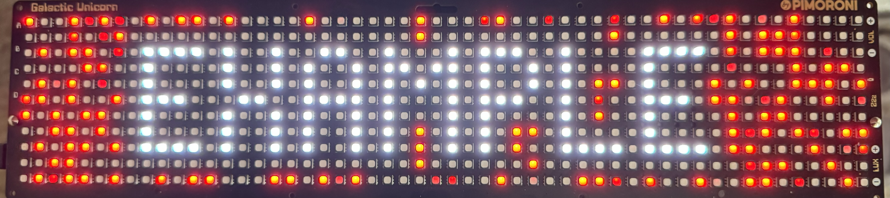

# Galactic Unicorn License Plate Display for Uber/Lyft Drivers

This project uses the Pimoroni Galactic Unicorn LED display and a Raspberry Pi Pico W to display a driver's license plate number with a blinking, colorful background. This can help Uber and Lyft riders easily identify their driver's vehicle.

Features

Displays your license plate number in large, outlined text for easy visibility.

The background blinks with random colors, making your vehicle stand out.

You can randomize the background color using the A button on the Galactic Unicorn.

You can randomize the text color using the B button.

Adjust the brightness of the display using the LUX +/- buttons.

Prerequisites

Pimoroni Galactic Unicorn LED display

Raspberry Pi Pico W

MicroPython firmware for the Raspberry Pi Pico W

Setup

Edit the text variable in the code to your license plate number.

Upload the main.py file to your Raspberry Pi Pico W.

Connect the Galactic Unicorn to your Raspberry Pi Pico W.

Usage
Power on your Galactic Unicorn with the Raspberry Pi Pico W.

Your license plate number will be displayed with a blinking, colorful background.

Press the A button to randomize the background color.

Press the B button to randomize the text color.

Use the LUX +/- buttons to adjust the brightness.

Customization

You can customize the code to change the following:

Text: Edit the text variable to your license plate number.

Initial Background Color: Change the color variable in the Blinking background settings section.

Outline Color: Change the pen color in the outline_text() function.

Animation Speed: Adjust the time.sleep() value in the nested loop within the while True loop.

License

This project is open-source and available under the MIT License. Feel free to modify and use the code for your own purposes.

Disclaimer
Please check with your local regulations and ridesharing company policies before using this device in your vehicle. Ensure that the display does not obstruct your view or distract other drivers.
